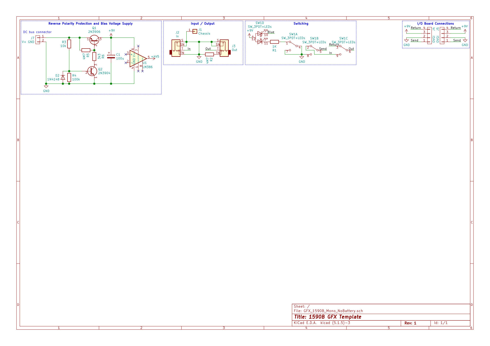

# Guitar Effects 1590B Mono

[](https://github.com/CostasAK/gfx-1590b-mono/blob/master/LICENSE)
<!--[](https://github.com/CostasAK/gfx-1590b-mono)
[](https://github.com/CostasAK/gfx-1590b-mono)
[](https://github.com/CostasAK/gfx-1590b-mono)-->

This is a KiCad template for guitar effects fitting the 1590B Hammond Enclosure. For effects with mono input and output and without a battery.

- [Setup](#setup)
  - [KiCad](#kicad)
  - [Git](#git)
- [Schematic](#schematic)
- [Layout](#layout)
- [Case](#case)
- [Acknowledgements](#acknowledgements)

## Setup

### KiCad

1. Ensure this template folder is in your `KICAD_USER_TEMPLATE_DIR` path.
2. _Create new project from template_.
3. Select the _1590B - Mono I/O, no battery_ template from the _User Templates_ tab.
4. Decide on a name and path for the new project.

### Git

The following clean and smudge commands are used on project files, to ignore the "date modified" field in them.

```bash
git config --local filter.kicad_project.clean "sed -E 's/^update=.*$/update=Date/'"
git config --local filter.kicad_project.smudge cat
```

The next clean and smudge commands are used to ignore hidden flags in schematics.

```bash
git config --local filter.kicad_sch.clean "sed -E 's/#(PWR|FLG)[0-9]+/#\1?/'"
git config --local filter.kicad_sch.smudge cat
```

Add these commands to the local or global git config to allow the filters in `.gitconfig` to work properly.

Finally, clean up the `README.md` and files that weren't automatically renamed by KiCad, such as the graphics/plots.

## Schematic

Use the `Send` net label for effect input, and `Return` for effect output.



## Layout


## Case

PDF of the Hammond 1590B Enclosure: [1590B PDF](http://www.hammondmfg.com/pdf/1590B.pdf)

## Acknowledgements

Inspired by a [template by Ryan McPherson from Electroblog](http://www.caravanelectroworks.com/?p=418)
